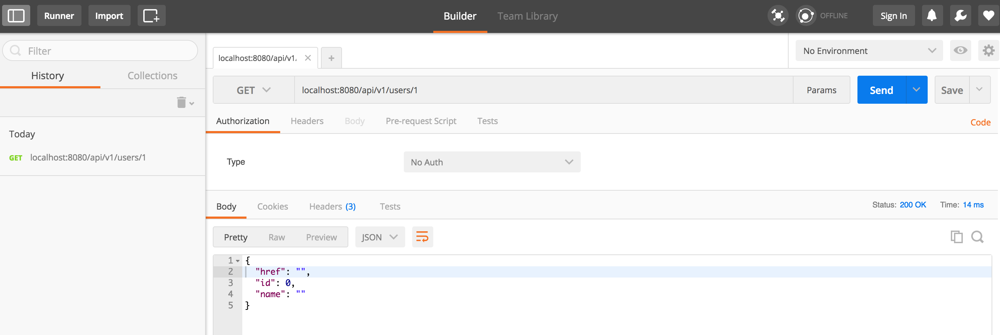

# template-restapi
[](https://travis-ci.org/humangas/template-restapi)  
Template repository for creating RESTful API server with go(goa).

# Installation
1. Install goa
1. Install this repository

## Install goa
```
$ go get -u github.com/goadesign/goa/...
```

## Install this template repository
```
$ git clone git@github.com:humangas/template-restapi.git
$ mv $GOPATH/src/template-restapi $GOPATH/src/<new_repository_name>
$ cd $GOPATH/src/<new_repository_name>
```


# Development 
Repeat the following procedure.
1. Desing
1. Build
1. Testing

## Design 
See also: [The goa API Design Language](https://goa.design/design/overview/)

```
$ vim design/design.go
```

## Build
See also: [Makefile](https://github.com/humangas/template-restapi/blob/master/Makefile)

```
$ make
```

## Testing
For example, it can be tested in the following way.

### curl
```
$ curl -XGET localhost:8080/api/v1/users/1
{"href":"","id":0,"name":""}
```

### client tool
This client tool code is generated by goa.

```
$ go run tool/template-ad-cli/main.go show users api/v1/users/1
2017/01/30 03:12:14 [INFO] started id=rQ3mzYTn GET=http://localhost:8080/api/v1/users/1
2017/01/30 03:12:14 [INFO] completed id=rQ3mzYTn status=200 time=5.177138ms
{"href":"","id":0,"name":""}
```

### Postman
It is also useful to use a test tool such as postman.
- [Postman](https://chrome.google.com/webstore/detail/postman/fhbjgbiflinjbdggehcddcbncdddomop?hl=ja)


